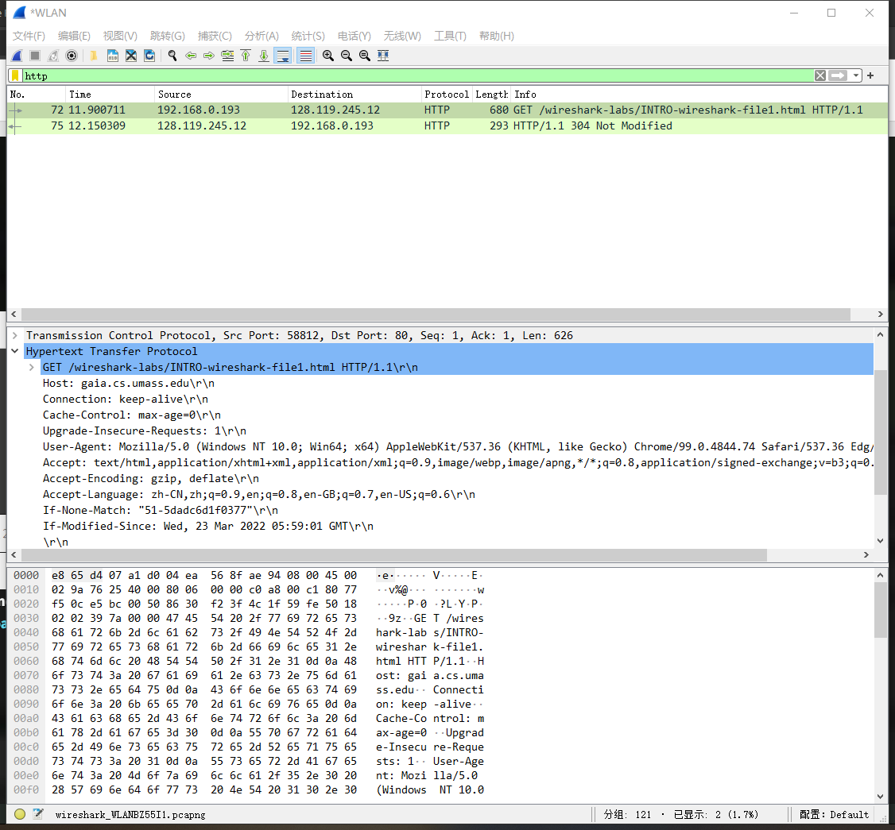
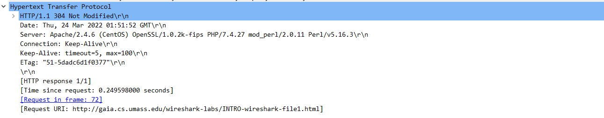

#   Chapter1 wireshark lab （Start）

## goal

install and learn to use wireshark

## procedure

打开wireshark，开始捕获后在浏览器键入网址[gaia.cs.umass.edu/wireshark-labs/INTRO-wireshark-file1.html](http://gaia.cs.umass.edu/wireshark-labs/INTRO-wireshark-file1.html)，停止捕获，并查看http相关的报文

## result

可以观测到如下界面

可查看发送和接受的报文中HTTP、TCP、IP协议的字段。

对于发送的报文，上图可以看到其http报文，包含了请求行（reques line）和首部行（header line）。

请求行给出了方法（GET）、URL以及HTTP的版本号

Hos给出了对象所在的主机；

Connection：keep-alive表明采用持续连接；

User-agent指明了浏览器类型

特别注意的是此报文包含了 If-Modified-Since head line，因为在实验之前已经打开过此网页，该对象的副本会被存储在Web缓存器中，在实验过程中，再次请求访问时，会通过一个条件GET（包含If-Modified-Since head line），若服务器返回 Not Modified，则说明Web缓存器中的对象仍为最新版本，那么就可直接从Web缓存器中获取对象。

回复的报文如下图所示：

