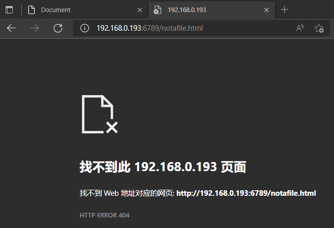

# Web Server Lab

---

## topic

> In this lab, you will learn the basics of socket programming for TCP connections in Python: how to create  a socket, bind it to a specific address and port, as well as send and receive a HTTP packet. You will also  learn some basics of HTTP header format.

---

## Request

> You will develop a web server that handles one HTTP request at a time. Your web server should accept  and parse the HTTP request, get the requested file from the server’s file system, create an HTTP response  message consisting of the requested file preceded by header lines, and then send the response directly to  the client. If the requested file is not present in the server, the server should send an HTTP “404 Not  Found” message back to the client.

---

## Code

```python
#import socket module
from socket import *
import sys #in order to terminate the program

serverSocket = socket(AF_INET, SOCK_STREAM) 
#AF_INET表明底层网络使用IPv4 SOCK_STREAM表明套接字类型，属于TCP
#Prepare a server socket
#Fill in start
serverPort = 6789
serverSocket.bind(('', serverPort)) #把套接字和端口绑定
serverSocket.listen(1) #server聆听client的TCP连接请求，且最大数为1
print("The server is ready to receive")
#Fill in end

while True:
    #Establish the connection
    print('Ready to serve...')
    connectionSocket, addr = serverSocket.accept() #Fill 
    #使用accept()方法，创建了一个名为connectionSocket的新套接字，完成了握手
    try:
        message = connectionSocket.recv(1024).decode() #Fill
        filename = message.split()[1]
        print(filename) #test
        f = open(filename[1:])
        outputdata = f.read() #Fill
        print(outputdata)  #test
        #Send one HTTP header line into socket
        #Fill in start
        connectionSocket.send("HTTP/1.1 200 OK\n\n".encode()) #文件存在时回复http响应
        #Fill in end
        #Send the content of the requested file to the client
        for i in range(0, len(outputdata)):
            connectionSocket.send(outputdata[i].encode())
        connectionSocket.send("\r\n".encode())
        
        connectionSocket.close()

    except IOError:
        #Send response message for file not found
        #Fill in start
        connectionSocket.send("HTTP/1.1 404 NOT FOUND\n\n".encode())
        #Fill in end
        #Close client socket
        #Fill in start 
        connectionSocket.close()
        #Fill in end
    
serverSocket.close()
sys.exit() #Terminate the program after sending the corresponding data
```


---

## Result

Running the server , open a browser and provide the URL http://IPADDR:PORTNUM/FILENAME.html. For example:http://128.238.251.26:6789/HelloWorld.html

when the file exits in the web server directory we can receive the content of the file


if the file does not exits, we will get a http response 404




## 遇到的问题

仅在与web server同一网络下可实现访问（尚未解决）