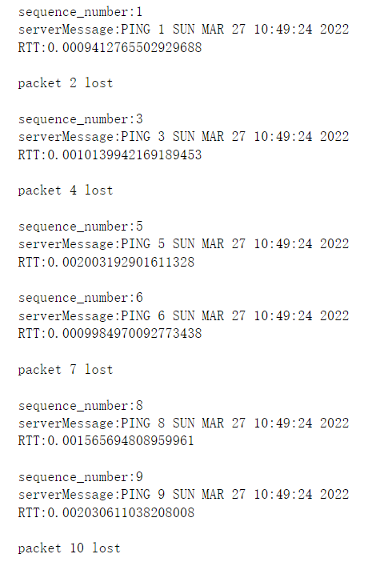

# UDP Pinger Lab

---

## topic

> learn how to  send and receive datagram packets using UDP sockets
>
> how to set a proper socket timeout
>
> gain familiarity with a Ping application and its usefulness in computing  statistics such as packet loss rate


---

## Request

> You will first study a simple Internet ping server written in the Python, and implement a  corresponding client. The functionality provided by these programs is similar to the functionality  provided by standard ping programs available in modern operating systems.

---

## Code

```python
#UDPPingerServer.py
# We will need the following module to generate randomized lost packets
import random
from socket import *

# Create a UDP socket 
# Notice the use of SOCK_DGRAM for UDP packets
serverSocket = socket(AF_INET, SOCK_DGRAM)
# Assign IP address and port number to socket
serverSocket.bind(('', 12000))

while True:
    # Generate random number in the range of 0 to 10
    rand = random.randint(0, 10) 
    # Receive the client packet along with the address it is coming from 
    message, address = serverSocket.recvfrom(1024)
    # Capitalize the message from the client
    message = message.upper()
    # If rand is less is than 4, we consider the packet lost and do not respond
    if rand < 4:
        continue
    # Otherwise, the server responds 
    serverSocket.sendto(message, address)
```

```python
#UDPPingerClient.py
from socket import *
import time

localtime = time.asctime(time.localtime(time.time()))

serverIP = "localhost"
serverPort = 12000
clientSocket = socket(AF_INET, SOCK_DGRAM)
clientSocket.settimeout(1) #设置Socket的timeout

for sequence_number in range(1,11):
    message = f"Ping {sequence_number} {localtime}"
    start = time.time()
    clientSocket.sendto(message.encode(),(serverIP,serverPort))
    try:
        serverMessage, serverAddress = clientSocket.recvfrom(1024)
        end = time.time()
        RTT = end - start  #计算RTT
        print(f"sequence_number:{sequence_number}")
        print(f"serverMessage:{serverMessage.decode()}")
        print(f"RTT:{RTT}\n")     
    except timeout:
        print(f"packet {sequence_number} lost\n")
            
clientSocket.close()
```


---

## Result

​	在主机运行Server后，运行Client，可以看到类似如下结果：



---

## emphasis

1.设置socket的timeout并进行exception handling

2.通过在发送报文前记录start时间戳，在收到报文后记录end时间戳，两者相减得到此次报文传递的RTT(Round Trip Time)

