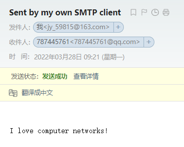

# Lab3 SMTP Lab

## Topic


>  acquire a better understanding of SMTP protocol.

## Request

> Your task is to develop a simple mail client that sends email to any recipient.
>
> Your client will need to  connect to a mail server, dialogue with the mail server using the SMTP protocol, and send an email  message to the mail server. 

## Code

```python
from socket import *
import base64

msg = "\r\n I love computer networks!"
endmsg = "\r\n.\r\n"

# Choose a mail server (e.g. Google mail server) and call it mailserver

mailserver = "smtp.163.com"   #Fill in start    #Fill in end
serverPort = 25
LoginID = base64.b64encode(b"jy_59815@163.com").decode() + '\r\n'
Password = base64.b64encode(b"RMJCWI**********").decode() + '\r\n'
From = "<jy_59815@163.com>"
To = "<787445761@qq.com>"

# Create socket called clientSocket and establish a TCP connection with mailserver
#Fill in start 
clientSocket = socket(AF_INET, SOCK_STREAM)
clientSocket.connect((mailserver,serverPort))
#Fill in end

recv = clientSocket.recv(1024).decode()
print(f"S:{recv}")
if recv[:3] != '220':
    print('220 reply not received from server.')

# Send HELO command and print server response.
heloCommand = 'HELO Sodascrew\r\n'
print(f"C:{heloCommand}")
clientSocket.send(heloCommand.encode())

recv1 = clientSocket.recv(1024).decode()
print(f"S:{recv1}")
if recv1[:3] != '250':
    print('250 reply not received from server.')

#登录授权
LOGIN = "AUTH LOGIN\r\n"
print(f"C:{LOGIN}")
clientSocket.send(LOGIN.encode())
recv_login = clientSocket.recv(1024).decode()
print(f"S:{recv_login}")
if recv_login[:3] != '334':
    print("334 login reply not received from server.")

print(f"C:{LoginID}")
clientSocket.send(LoginID.encode())   #输入id
recv_id = clientSocket.recv(1024).decode()
print(f"S:{recv_id}")
if recv_id[:3] != '334':
    print("535 id reply not received from server.")

print(f"C:{Password}")
clientSocket.send(Password.encode())
recv_password = clientSocket.recv(1024).decode()
print(f"S:{recv_password}")
if recv_password[:3] != '235':
    print("535 password reply not received from server.")
        
    
# Send MAIL FROM command and print server response.
# Fill in start
mailFrom = f"MAIL FROM: {From}\r\n"
print(f"C:{mailFrom}")
clientSocket.send(mailFrom.encode())

recv2 = clientSocket.recv(1024).decode()
print(f"S:{recv2}")
if recv2[:3] != '250':
    print('250 reply not received from server.')
# Fill in end

# Send RCPT TO command and print server response. 
# Fill in start
PCRTTO = f"RCPT TO: {To}\r\n"
print(f"C:{PCRTTO}")
clientSocket.send(PCRTTO.encode())

recv3 = clientSocket.recv(1024).decode()
print(f"S:{recv3}")
if recv3[:3] != '250':
    print('250 reply not received from server.')
# Fill in end

# Send DATA command and print server response. 
# Fill in start
print("C:DATA\r\n")
clientSocket.send("DATA\r\n".encode())

recv4 = clientSocket.recv(1024).decode()
print(f"S:{recv4}")
if recv4[:3] != '354':
    print('354 reply not received from server.')
# Fill in end

# Send message data.
# Fill in start
Send = 'From:' + From + '\r\n'
Send += 'TO:' + To + '\r\n'
Send += 'Subject:' + 'Sent by my own SMTP client' + '\r\n'
Send += msg
print(f"C:{Send}")
clientSocket.send(Send.encode())
# Fill in end

# Message ends with a single period.
# Fill in start
print(f"C:{endmsg}")
clientSocket.send(endmsg.encode())
recv5 = clientSocket.recv(1024).decode()
print(f"S:{recv5}")
if recv5[:3] != '250':
    print("250 reply not received from server.")
# Fill in end

# Send QUIT command and get server response.
# Fill in start
print("C:QUIT\r\n")
clientSocket.send("QUIT\r\n".encode())
recv6 = clientSocket.recv(1024).decode()
print(f"S:{recv6}")
if recv6[:3] != '221':
    print("221 reply not received from server.")
# Fill in end

clientSocket.close()
```


## Result

此lab要点在于根据SMTP协议规定的发送接收流程实现client与SMTP server的对话，书78页给出了基本的对话框架。给出了基本的命令（HELO, MAIL FROM, RCPT TO, DATA, QUIT），以及基本的服务器回复讯息。

难点在于与实际的服务器对话时需要验证身份（此部分在书上没有），对于163邮箱的验证流程参考如下博客：[《计算机网络自顶向下》Socket Lab3 SMTP Lab_Love 6的博客-CSDN博客](https://blog.csdn.net/qq_37500516/article/details/120050400)

运行程序后会得到如下结果，展示了client与server的建立TCP连接后的完整对话：

```python 
S:220 163.com Anti-spam GT for Coremail System (163com[20141201])
C:HELO Sodascrew
S:250 OK
C:AUTH LOGIN
S:334 dXNlcm5hbWU6
C:anlfNTk4MTVAMTYzLmNvbQ==
S:334 UGFzc3dvcmQ6
C:Uk1KQ1dJSUVWQ09HSUFXTA==
S:235 Authentication successful
C:MAIL FROM: <jy_59815@163.com>
S:250 Mail OK
C:RCPT TO: <787445761@qq.com>
S:250 Mail OK
C:DATA
S:354 End data with <CR><LF>.<CR><LF>
C:From:<jy_59815@163.com>		#邮件报文
TO:<787445761@qq.com>
Subject:Sent by my own SMTP client

 I love computer networks!
C:
.
S:250 Mail OK queued as smtp12,EMCowAD3XbqrDUFi++yuBA--.65366S2 1648430509
C:QUIT
S:221 Bye
```

并且目标邮箱成功接收到邮件



