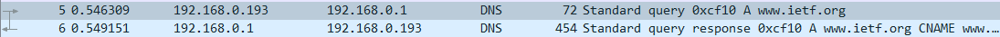

## HTTP

### conditional GET/response

连续两次请求同一网站，相比第一次请求，第二次请求增加了“IF-MODIFIED-SINCE” head line，同时第二次的回复中，因为对象并没有修改，服务器没有将对象的内容发送给客户。（如第一次wireshark实验所见）

### HTML Documents with Embedding Objects

给定的网页中包含两张图片（图片本身不在HTML文件中，但图片的URL在文件中），因此会依次发送三次请求分别获取HTML文件和两张图片


### HTTP  Authentication

对于需要授权验证身份（基础情况即为输入用户名和密码）的网页对象。


Client发送第一条GET请求后，Server会返回401 Unauthorized status code 并带有 WWW-Authentication head field 


用户输入用户名密码后，Client再次发送一条请求，包含 Authorization head field，内容为Basic 和 用户名冒号密码的编码串。


如果验证通过，Server会发送网页文件，否则会发送401 Unauthorized response表明验证未通过。

上面用户名和密码的编码是 Base64 format，通过  [Base64-Online Base64 Decoder and Encoder](https://www.motobit.com/util/base64-decoder-encoder.asp) 即可实现编解码，因此通过这种简单的方式实现授权是很不安全的。


## DNS

### nslookup

通过nslookup程序可以指定对权威DNS服务器查询指定网站的IP地址


### ipconfig

用于显示当前的TCP/IP信息

```dos
ipconfig /flushdns  #to clear the cache in your host
```


### Tracing DNS with wireshark

##### 打开网站[IETF | Internet Engineering Task Force](https://www.ietf.org/)




通过上图可以得知此DNS请求是通过UDP协议实现的，在UDP协议字段中可以获得Source Port和Destination Port，在IP字段可以看到Src为本机的IP地址，而Dst正是使用nslookup时默认的权威DNS服务器的IP地址。

观察DNS服务器的response


可以得知此DNS query的类型是A（即回复主机名和其IP地址）。

Answers中包含三条信息，其中第一条类型为CNAME，可以获取主机的规范主机名。


在紧接着的两个由我的主机发出的TCP SYN packet的目标IP地址正是上面DNS response报文中回复的IP地址。

##### nslookup

