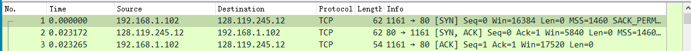
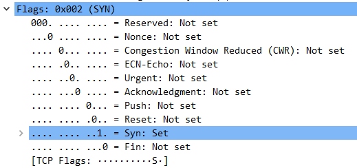
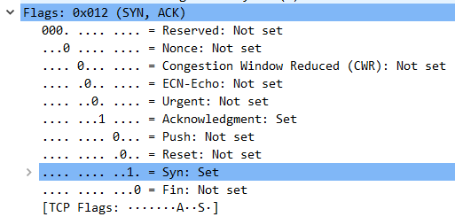
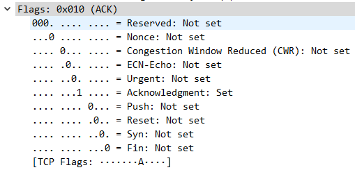
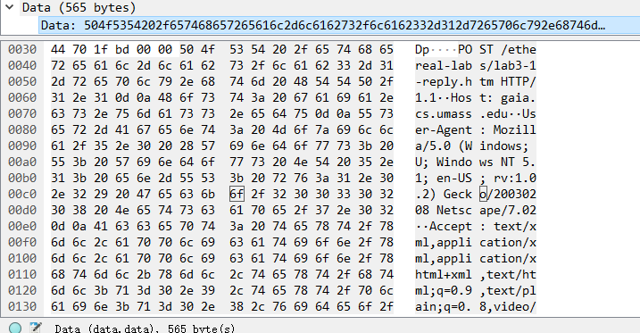
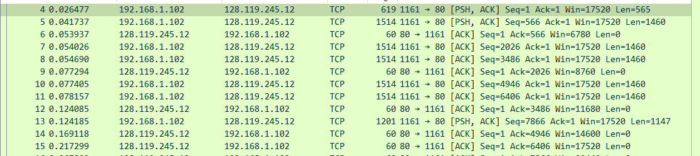
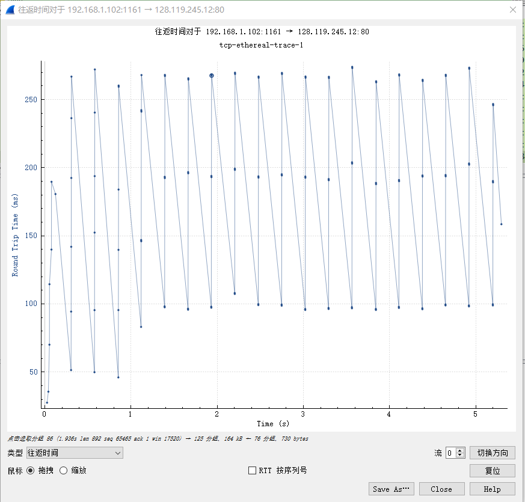
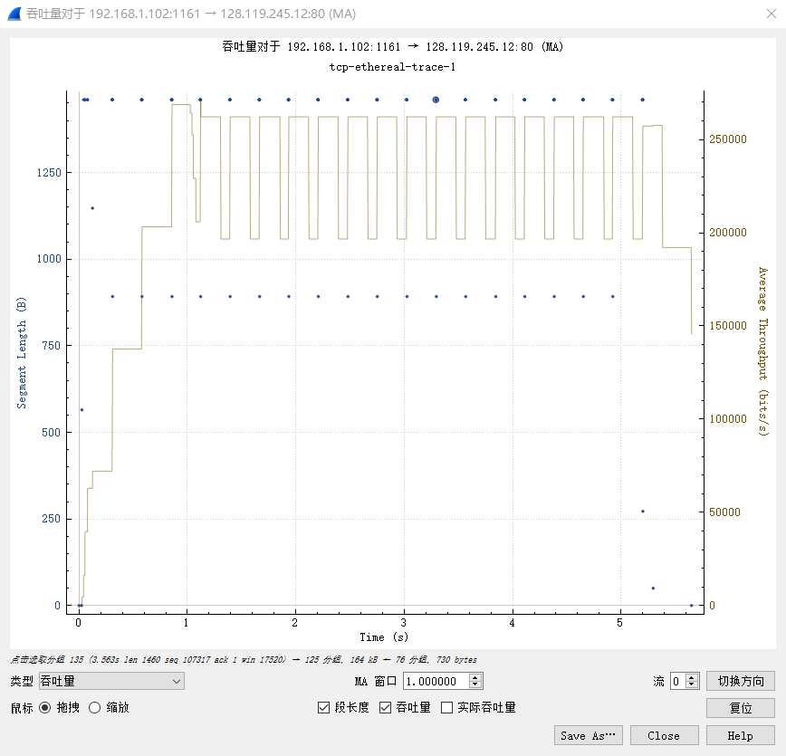
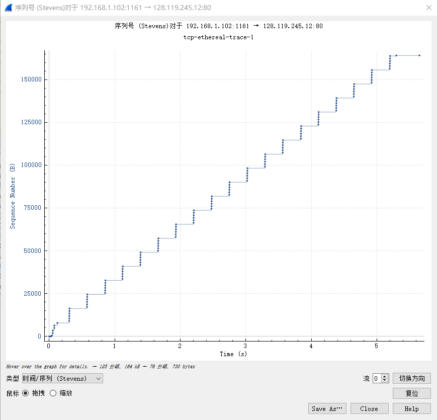

# TCP

将一个包含ASCII内容的txt文件从主机发送到服务器，查看tcp-ethereal-trace-1文件中的报文段

## 建立TCP连接

1. TCP SYN  Seq=0（sequence number）   实现了初始化序列号

   Flags=0x002（SYN）SYN位被置1，表明是SYN segement

2. TCP SYNACK Seq=0

   Flags=0x012（SYNACK） SYN、ACK两个位置1

3. TCP ACK Seq=1

   Flags=0x010（ACK） ACK位置1

   

## 包含HTTP POST的TCP报文以及后续包含DATA的报文

查看第四条TCP报文的DATA field可以看到POST命令

将此报文视作TCP连接的第一条报文，那么前六条报文的Seq，time，ACK，RTT，length等信息如下表：

| 计数 | Seq  | 发送时间 | ACK时间  | RTT      | EstimatedRTT        | Length |
| ---- | :--: | :------: | -------- | -------- | ------------------- | ------ |
| 1    |  1   | 0.026477 | 0.053937 | 0.02746‬  | 0.02746             | 619    |
| 2    | 566  | 0.041737 | 0.77294  | 0.035557‬ | 0.028472125         | 1514   |
| 3    | 2026 | 0.54026  | 0.124085 | 0.070059‬‬ | 0.033670484375      | 1514   |
| 4    | 3486 | 0.54690  | 0.169118 | 0.114428‬‬ | 0.043765173828125   | 1514   |
| 5    | 4946 | 0.077405 | 0.217299 | 0.139894‬‬ | 0.05578127709960937 | 1514   |
| 6    | 6406 | 0.078157 | 0.267802 | 0.189645‬‬ | 0.07251424246215821 | 1514   |

往返时间和吞吐量可通过wireshark绘制如下图：

上图于书本181页拥塞控制导致的RTT结果符合

## TCP拥塞控制

绘制时间序列号图如下：（下图中每个点表示一个TCP segment的发送）

